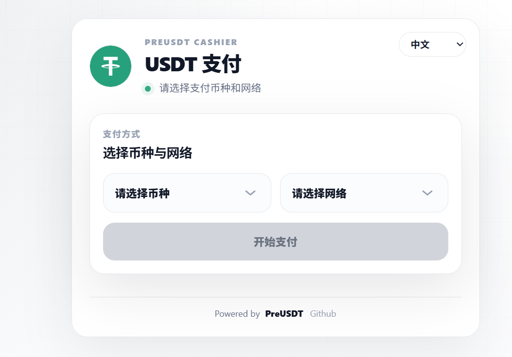
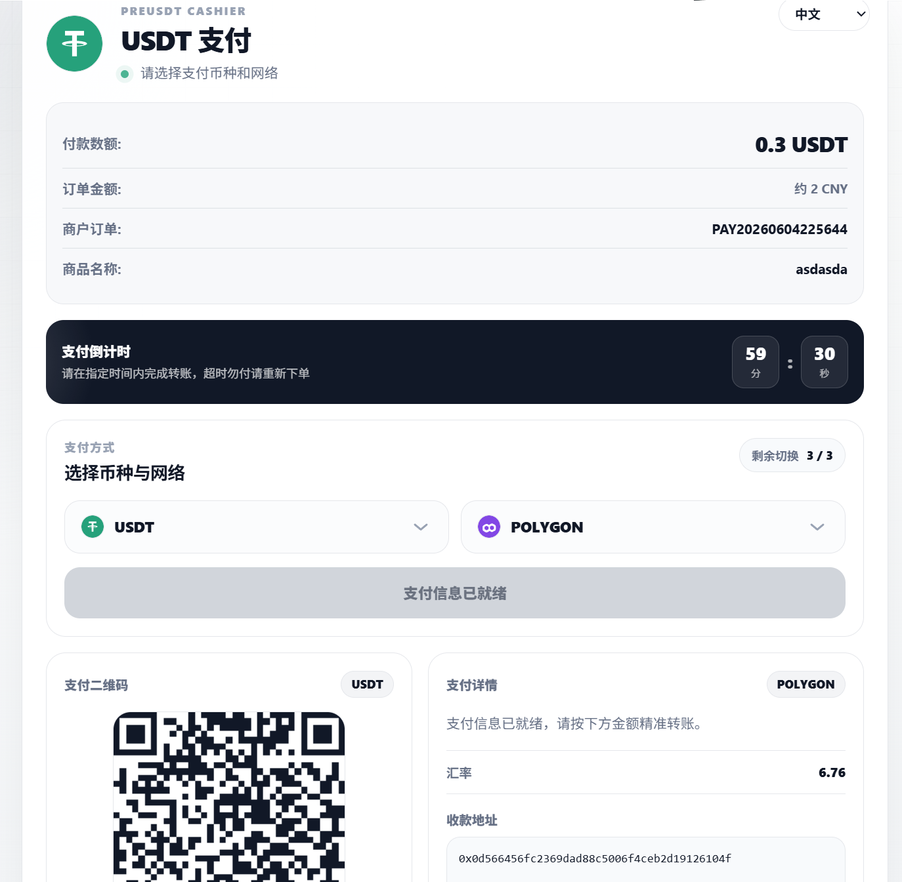
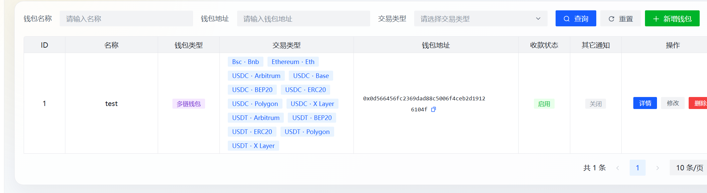

# PreUSDT

PreUSDT 是面向个人和小团队的自托管多链加密货币收款网关，延续 EPusdt/BEpusdt 的轻量部署和插件兼容思路，并扩展到多币种、多网络、开放收银台、后台运营控制台与通知模板能力。

本项目用于研究和自托管场景，不提供任何形式的收费代运营服务，不鼓励任何带金融属性的衍生交易行为。使用者需要自行承担部署、合规、节点、钱包和资金安全责任。

## 当前定位

- 自托管收款：单体二进制部署，适合个人站点、小型业务和二次开发。
- 多链收银台：支持用户在允许范围内选择或切换支付链与币种。
- 兼容接入：保持 Epusdt/易支付风格的 API 与回调体验，降低旧项目迁移成本。
- 运维后台：集中管理订单、钱包地址、通知渠道、首页模板、收银台模板和系统配置。

## 核心能力

- 多币种：USDT、USDC、TRX、ETH、BNB 等。
- 多网络：TRON、Ethereum、BNB Smart Chain、Polygon、Arbitrum One、Base、Solana、Aptos、X Layer、Plasma 等，完整能力以 [trade-type 文档](./docs/trade-type.md) 和实际配置为准。
- 钱包模式：支持普通钱包地址、地址独占模式、多链钱包地址和基础分类，降低 EVM/L2 共地址场景下的误选风险。
- 实时支付切换：开放收银台支持按订单配置切换次数，切换后旧链/旧币种付款不会命中新订单状态。
- 汇率与金额：支持主流法币汇率同步、自定义支付精度、递增颗粒度和不定额收款场景。
- 链上确认：底层区块扫描、确认数处理、非订单交易监控和余额变动通知。
- 通知广播：支持订单回调、Telegram 通知模板、MQTT 交易消息广播。
- 模板定制：支持默认首页模板、收银台模板、Telegram 消息模板的后台配置。
- 管理后台：提供订单、钱包、系统配置、仪表盘和通知渠道管理。

## 快速启动

Docker 启动后访问 `http://服务器IP:8080`，首次使用请先进入后台完成钱包、交易网络、通知和安全入口配置。

```bash
docker run -d --restart=unless-stopped -p 8080:8080 autoccb/preusdt:latest
```

如果你使用源码构建，请优先阅读对应部署文档，并确认服务器时间、RPC 节点和回调域名配置正确。

## 文档入口

- 安装部署：[Docker](docs/docker/docker.md) · [Linux](docs/linux/install.md) · [1Panel](./docs/1panel/README.md) · [宝塔](./docs/bt_panel/README.md)
- 接口接入：[API 对接](docs/api/api.md) · [订单回调](docs/notify/readme.md) · [工作机制](docs/api/how-it-works.md)
- 兼容对接：[独角数卡](docs/api/dujiao-next/dujiao-next.md) · [彩虹易支付](https://github.com/v03413/Epay-BEpusdt) · [WHMCS](https://github.com/v03413/whmcs-gateway-epusdt) · [EdgeKey](docs/api/edge-key/edge-key.md) · [其它](docs/api/other.md)
- 模板配置：[收银台模板](docs/payment-template/README.md) · [后台入口重置](./docs/faq/login-reset.md) · [RPC 节点配置](docs/faq/rpc-endpoint.md)
- 运维说明：[HTTPS 配置](./docs/ssl.md) · [时钟同步](docs/linux/systemd-timesyncd.md) · [RPC 节点稳定性](./docs/faq/rpc-endpoint.md)

## 接入提醒

- 订单交易强依赖服务器时间，请保持 NTP 同步，否则可能导致订单过期、匹配或回调异常。
- 生产环境请使用 HTTPS，并谨慎配置反向代理的 Host、Forwarded Header 和回调地址白名单。
- 多链钱包共用地址时，应只开放你确认可监控、可归集、可承担 Gas 成本的网络。
- 收银台允许切换支付方式时，请提示用户只向当前页面展示的链、币种、地址和金额转账。
- 自定义首页、收银台、通知模板属于展示层能力，不应承载私钥、密钥或未脱敏的敏感信息。

## 功能截图

| 前台收银 | 后台订单 | 后台列表 |
| --- | --- | --- |
|  |  |  |

## 常见问题

- [服务器配置性能选型推荐](./docs/faq/server.md)
- [后台入口账密忘记重置教程](./docs/faq/login-reset.md)
- [RPC 节点稳定性说明指南](./docs/faq/rpc-endpoint.md)
- [PreUSDT 与上游项目说明](./docs/faq/epusdt.md)

## 社区与来源

PreUSDT 来源于 BEpusdt/EPusdt 生态的自托管收款思路，继续保留轻量、兼容、可二次开发的方向。

- 当前仓库：[chunkburst/PreUSDT](https://github.com/chunkburst/PreUSDT)
- 上游项目：[EPusdt 说明](./docs/faq/epusdt.md)

## 免责声明

本项目仅供学习、研究和自托管实践。区块链转账不可逆，请在上线前充分测试订单匹配、回调通知、RPC 稳定性、钱包权限和备份策略。任何因部署、配置、二次开发或第三方使用造成的资金、业务或合规风险，均由使用者自行承担。
